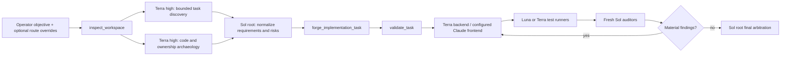

# Multimodel Task-Creation Scenario

This scenario shows how a GPT-5.6 Sol root uses Arbiter Forge without spending Sol tokens on every
scan, edit, test command, and browser step. Arbiter Forge compiles the contract; Codex or another
host performs the launches.



## 1. Operator request

The operator starts a Sol task with an outcome, not a giant orchestration manual:

```text
Use Arbiter Forge to prepare and execute an implementation task for a tenant-scoped GraphQL pricing
editor with Playwright evidence. Prefer my `arbiter-forge-ui-claude` custom agent for frontend work;
fall back to GPT-5.6 Terra high. Keep exact-model requirements best-effort except the final security
audit, which must use an independently configured route.
```

The root does not immediately write code. It inspects the workspace and classifies the task as
Critical because tenant scope, money, GraphQL, and browser UI are material.

## 2. Read-only inspection

```json
{
  "workspaceRoots": ["/work/application"],
  "sourcePaths": [
    "/work/application/AGENTS.md",
    "/work/application/docs/pricing.md"
  ]
}
```

`inspect_workspace` returns snapshot identity, rule paths, source hashes, harness signals, and a
`contextHash`. It does not choose models or read arbitrary source contents.

## 3. Split task framing

For Standard or Critical work, the host uses bounded fresh contexts before Forge:

1. `task_discovery`: Terra high reads only intent and canonical documentation and returns candidate
   requirements, acceptance claims, and open decisions.
2. `implementation_analyst`: another Terra high context reads code, tests, and ownership rules and
   returns current behavior, owners, integration boundaries, and falsifiers.
3. Sol receives only those typed reports, checks material conflicts against primary sources, and
   constructs the Forge request.

Compact work skips these agents unless the objective is genuinely ambiguous.

When the host uses a direct model or custom-agent override, it launches with `fork_turns="none"` or
a bounded positive turn count. `fork_turns="all"` would inherit the Sol root route and defeat the
assignment.

## 4. Forge request

The default optimized matrix already maps backend coding to Terra, test execution to Luna with a
Terra fallback, and independent audits to Sol. The framing roles from step 3 are already complete
and are not emitted again in the implementation execution plan. The operator overrides only the
special lanes:

```json
{
  "objective": "Implement a tenant-scoped GraphQL pricing editor with complete Playwright proof.",
  "repositories": [
    {
      "id": "application",
      "root": "/work/application",
      "contextHash": "<inspect_workspace contextHash>"
    }
  ],
  "riskSignals": [
    "browser_ui",
    "graphql_client",
    "tenant_isolation",
    "money_or_pricing"
  ],
  "implementationSurfaces": ["backend_or_shared", "frontend"],
  "modelRouting": "adaptive",
  "capabilities": {
    "agentIsolation": "supported",
    "modelSelection": "supported",
    "physicalWorktrees": "supported",
    "goalTool": "supported",
    "playwrightHarness": "available",
    "routeInventoryComplete": true,
    "currentRootRoute": {
      "provider": "openai",
      "model": "gpt-5.6-sol",
      "reasoningEffort": "high"
    },
    "availableAgentTypes": ["arbiter-forge-ui-claude", "security-reviewer"],
    "availableModels": [
      {
        "provider": "openai",
        "model": "gpt-5.6-sol",
        "reasoningEfforts": ["medium", "high"]
      },
      {
        "provider": "openai",
        "model": "gpt-5.6-terra",
        "reasoningEfforts": ["low", "medium", "high", "xhigh"]
      },
      {
        "provider": "openai",
        "model": "gpt-5.6-luna",
        "reasoningEfforts": ["low", "medium"]
      }
    ]
  },
  "roleRouting": {
    "assignments": [
      {
        "role": "frontend_worker",
        "candidates": [
          {
            "execution": "codex_custom_agent",
            "agentType": "arbiter-forge-ui-claude",
            "reasoningEffort": "inherit"
          },
          {
            "execution": "codex_subagent",
            "provider": "openai",
            "model": "gpt-5.6-terra",
            "reasoningEffort": "high"
          }
        ],
        "onUnavailable": "fallback"
      },
      {
        "role": "code_quality_auditor",
        "candidates": [
          {
            "execution": "codex_custom_agent",
            "agentType": "security-reviewer",
            "reasoningEffort": "inherit"
          }
        ],
        "onUnavailable": "block",
        "diversityMode": "require",
        "preferDifferentModelFromRoles": ["implementation_worker"],
        "preferDifferentProviderFromRoles": ["implementation_worker"]
      }
    ]
  }
}
```

Provider aliases, credentials, and exact third-party model IDs remain operator-owned. The
`arbiter-forge-ui-claude` custom agent is valid only when its Codex role file points to a compatible
provider/gateway. A native Anthropic Messages endpoint is not automatically a Codex model provider.
An alternative Claude CLI/MCP route must use `execution: "external_adapter"` and name an adapter
present in `availableExternalAdapters`. Provider, model, and reasoning for custom-agent/external
candidates live in their named configuration and runtime attestation, not in the Forge candidate.

For a Responses-compatible gateway, the operator can define the role outside Forge:

```toml
# ~/.codex/agents/arbiter-forge-ui-claude.toml
name = "arbiter-forge-ui-claude"
description = "Frontend implementation through the operator's Claude-compatible gateway."
model_provider = "<operator-responses-provider-id>"
model = "<operator-claude-model-id>"
model_reasoning_effort = "high"
sandbox_mode = "workspace-write"
developer_instructions = """
Own only the assigned frontend files. Preserve project conventions, run targeted UI checks, and
return changed files, commands, exit codes, screenshots/traces, and residual risks to the arbiter.
"""
```

Then register that role in the operator's Codex config using the normal `[agents.<name>]` plus
`config_file` mechanism. Forge intentionally does not install or mutate this role because provider
aliases and credentials differ by operator.

## 5. Deterministic output and validation

`forge_implementation_task` returns:

- the ready prompt and its SHA-256;
- a `routingPlan` containing only applicable execution roles;
- ordered candidates with `available`, `unavailable`, or `unknown` status;
- a `routingPlanHash` bound into the prompt invariant manifest;
- warnings for an unavailable preference and a blocking error for a proven-exhausted required lane.

The root calls `validate_task` with the exact original request, prompt, operation, and Forge hash.
Manual prompt edits are structural-only; change the typed request and re-forge instead.

This ends the creation task. For minimum token use, launch a new clean Sol task with only the
validated prompt. Do not forward the inspection transcript, analyst logs, MCP responses, or raw
Forge JSON unless a field is required by the execution contract.

## 6. Execution and route attestation

Before every spawn, the root creates a route-ledger row:

```json
{
  "role": "frontend_worker",
  "requestedRoute": "codex_custom_agent:arbiter-forge-ui-claude",
  "actualRoute": "codex_custom_agent:arbiter-forge-ui-claude",
  "routingStatus": "selected",
  "fallbackReason": null,
  "forkTurns": "none",
  "snapshot": "<git HEAD plus dirty manifest hash>",
  "tools": ["browser", "apply_patch"]
}
```

Neither the root nor any spawned worker/auditor calls Arbiter Forge during execution. They receive
instructions directly from the compiled prompt and root-issued scope packets. Findings go into the
root correction ledger; they do not trigger a new Forge call unless the operator changes the typed
task itself.

If that custom agent is absent and `onUnavailable` is `fallback`, the ledger names Terra high as
the actual route and records why Claude did not run. If `onUnavailable` is `block`, the lane does
not start.

The Sol root reads distilled reports, routes corrections to the owning writer, invalidates stale
evidence, and repeats only affected checks. It issues the final verdict only after all required
audits pass on one current integrated snapshot.

## Host without multiple models

The same task still works when the host cannot select models. Omit route inventory or report model
selection as unsupported. Forge retains explicit `inherited_subagent` fallbacks and marks routing
unknown or degraded. Quality then comes from narrower scopes, fresh contexts, independent evidence,
and strict arbitration rather than a false multimodel claim.
